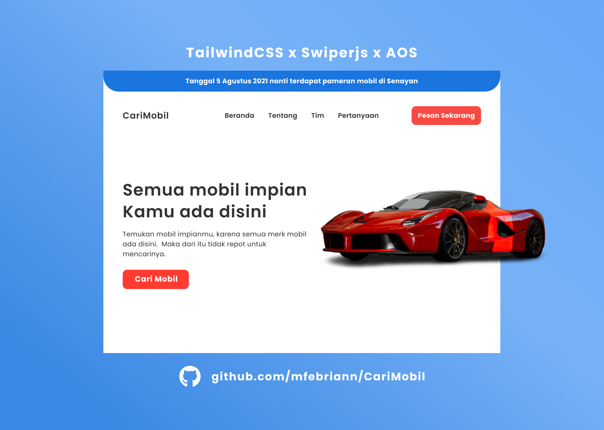

# Just share my simple project

## Top 3 awesome projects

1. Kopai
   

2. Beli-Hamburger
   

3. CariMobil
   

## Website Landing Page

#### 1. DrinkingCoffe [13 - October - 2020]
- Source code: [Code](https://github.com/mfebriann/DrinkingCoffee)
- Demo website: [Demo](https://mfebriann.github.io/DrinkingCoffee/)

#### 2. CemilanTaruna [21 - July - 2020]
- Source code: [Code](https://github.com/mfebriann/CemilanTaruna)
- Demo website: [Demo](https://mfebriann.github.io/CemilanTaruna/)

#### 3. SlicingMYPERTAMINA [14 - December - 2020]
- Source code: [Code](https://github.com/mfebriann/SlicingMYPERTAMINA)
- Demo website: [Demo](https://mfebriann.github.io/SlicingMYPERTAMINA/)

#### 4. Find-Island [16 - January - 2021]
- Source code: [Code](https://github.com/mfebriann/find-island)
- Source design: [Design](https://www.figma.com/file/iBb5o0O1h88XHTwLl4k0eJ/Find-Island)
- Demo website: [Demo](https://mfebriann.github.io/find-island/)

#### 5. CariKucing [25 - January - 2021]
- Source code: [Code](https://github.com/mfebriann/carikucing)
- Source design: [Design](https://www.figma.com/file/zUprqBOcHEjoWWj5WDTrBT/CariKucing)
- Demo website: [Demo](https://mfebriann.github.io/carikucing/)

#### 6. Beli-Hamburger [9 - March - 2021]
- Source code: [Code](https://github.com/mfebriann/beli-hamburger)
- Source design: [Design](https://www.figma.com/file/DPwyNstEOBMTaeVtDeGVLa/Beli-Hamburger)
- Demo website: [Demo](https://beli-hamburger.netlify.app/)

#### 7. PropIn [16 - March - 2021]
- Source code: [Code](https://github.com/mfebriann/PropIn)
- Demo website: [Demo](https://prop-in.vercel.app/)

#### 8. Kopai [9 - June - 2021]
- Source code: [Code](https://github.com/mfebriann/Kopai)
- Source design: [Design](https://www.figma.com/file/PREGeOknaCpLzTEyZQpM8c/Kopai)
- Demo website: [Demo](https://kopai.vercel.app/)

#### 9. CariMobil [11 - July - 2021]
- Source code: [Code](https://github.com/mfebriann/CariMobil)
- Source design: [Design](https://www.figma.com/file/2Jw1nxz1j2H9UVFnr7mElu/CariMobil?node-id=0%3A1)
- Demo website: [Demo](https://mfebriann.github.io/CariMobil/)

## Learn Javascript

#### 1. To-do list [23-April-2021]
- Source code: [Code](https://github.com/mfebriann/to-do-list)
- Demo website: [Demo](https://mfebriann.github.io/to-do-list/)

#### 2. Menghitung luas dan keliling lingkaran [7 - May - 2021]
- Source code: [Code](https://github.com/mfebriann/menghitung-luas-dan-keliling-lingkaran)
- Demo website: [Demo](https://mfebriann.github.io/menghitung-luas-dan-keliling-lingkaran/)

#### 3. Menentukan bilangan ganjil genap [8 - May - 2021]
- Source code: [Code](https://github.com/mfebriann/menentukan-bilangan-ganjil-genap)
- Demo website: [Demo](https://mfebriann.github.io/menentukan-bilangan-ganjil-genap/)

#### 4. Login dengan captcha [9 - May - 2021]
- Source code: [Code](https://github.com/mfebriann/login-dengan-captcha)
- Demo website: [Demo](https://mfebriann.github.io/login-dengan-captcha/)

#### 5. Membuat komentar dinamis [26 - June - 2021]
- Source code: [Code](https://github.com/mfebriann/komentar-dinamis)
- Demo website: [Demo](https://mfebriann.github.io/komentar-dinamis)

## Designs

#### 1. CariMakan (Mobile App) [9 - February - 2021]
- Source design: [Design](https://www.figma.com/file/blIBoKiYrCFabVIBAIwO2O/CariMakan-Mobile-App?node-id=0%3A1)
- See design: [Demo](https://dribbble.com/shots/15286614-CariMakan)

**If there is a problem with my project, you can send the issues**

