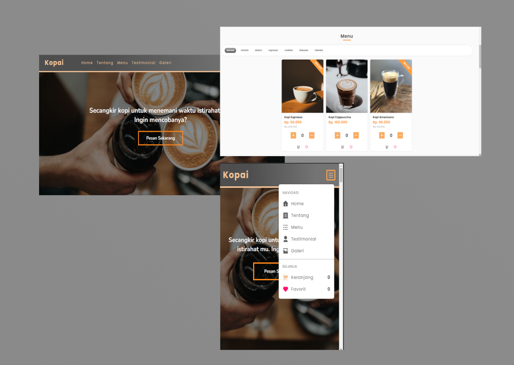
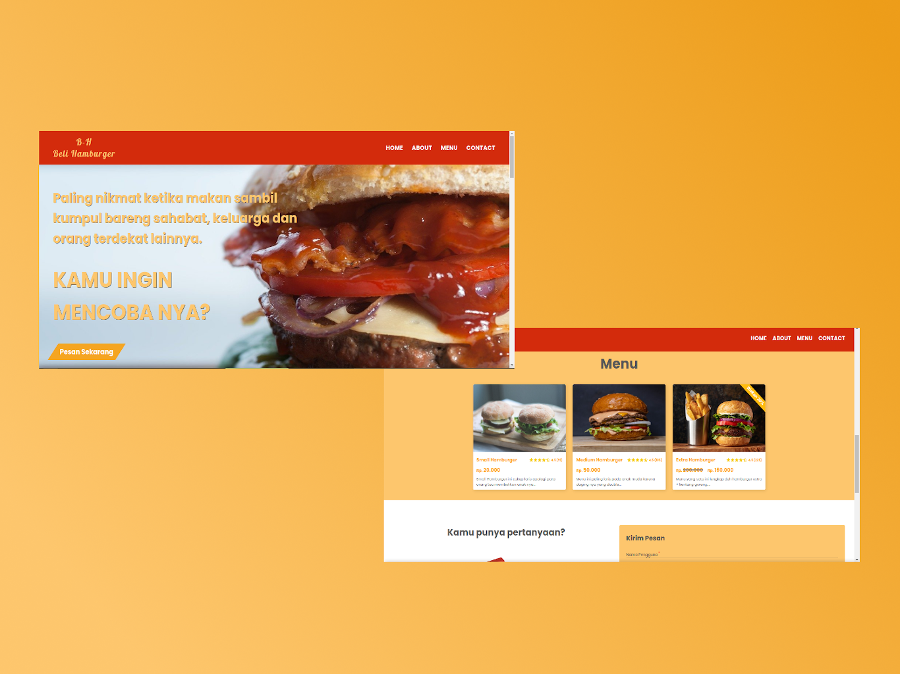
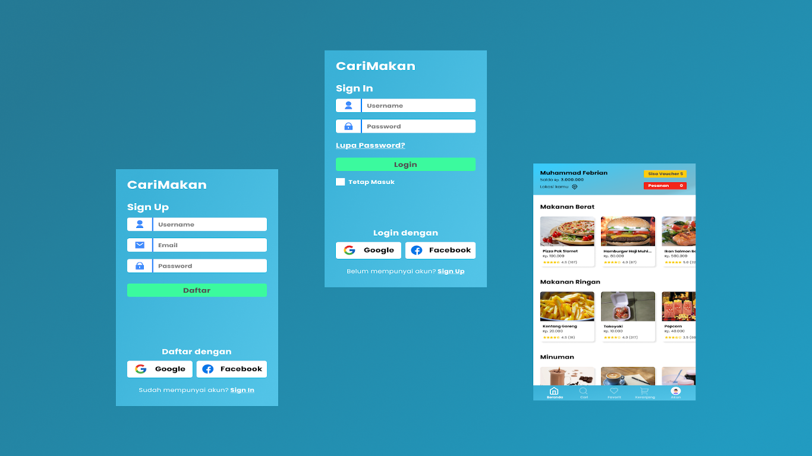

# Just share my simple project 

## Top 3 awesome projects

1. [Kopai](https://github.com/mfebriann/list-my-project#8-kopai-9---june---2021) [ [Demo](https://kopai.vercel.app/) ]

2. [Beli-Hamburger](https://github.com/mfebriann/list-my-project#6-beli-hamburger-9---march---2021) [ [Demo](https://beli-hamburger.netlify.app/) ]

3. [CariMakan (Mobile App)](https://github.com/mfebriann/list-my-project#1-carimakan-mobile-app-9---february---2021) [ [Demo](https://www.figma.com/file/blIBoKiYrCFabVIBAIwO2O/CariMakan-Mobile-App?node-id=0%3A1) ] 

## Website Landing Page

#### 1. DrinkingCoffe [13 - October - 2020]
 - Source code: [DrinkingCoffe - Source Code](https://github.com/mfebriann/DrinkingCoffee)
 - Demo website: [DrinkingCoffe](https://mfebriann.github.io/DrinkingCoffee/)

#### 2. CemilanTaruna [21 - July - 2020]
- Source code: [CemilanTaruna - Source Code](https://github.com/mfebriann/CemilanTaruna)
- Demo website: [CemilanTaruna](https://mfebriann.github.io/CemilanTaruna/)

#### 3. SlicingMYPERTAMINA [14 - December - 2020]
- Source code: [SlicingMYPERTAMINA - Source Code](https://github.com/mfebriann/SlicingMYPERTAMINA)
- Demo website: [SlicingMYPERTAMINA](https://mfebriann.github.io/SlicingMYPERTAMINA/)

#### 4. Find-Island [16 - January - 2021]
- Source code: [Find-Island - Source Code](https://github.com/mfebriann/find-island)
- Source design: [Find-Island - Source Design](https://www.figma.com/file/iBb5o0O1h88XHTwLl4k0eJ/Find-Island)
- Demo website: [Find-Island](https://mfebriann.github.io/find-island/)

#### 5. CariKucing [25 - January - 2021]
- Source code: [CariKucing - Source Code](https://github.com/mfebriann/carikucing)
- Source design: [CariKucing - Source Design](https://www.figma.com/file/zUprqBOcHEjoWWj5WDTrBT/CariKucing)
- Demo website: [CariKucing](https://mfebriann.github.io/carikucing/)

#### 6. Beli-Hamburger [9 - March - 2021]
- Source code: [Beli-Hamburger - Source Code](https://github.com/mfebriann/beli-hamburger)
- Source design: [Beli-Hamburger - Source Design](https://www.figma.com/file/DPwyNstEOBMTaeVtDeGVLa/Beli-Hamburger)
- Demo website: [Beli-Hamburger](https://beli-hamburger.netlify.app/)

#### 7. PropIn [16 - March - 2021]
- Source code: [PropIn - Source Code](https://github.com/mfebriann/PropIn)
- Demo website: [PropIn](https://prop-in.vercel.app/) 

#### 8. Kopai [9 - June - 2021]
- Source code: [Kopai - Source Code](https://github.com/mfebriann/Kopai)
- Source design: [Kopai - Source Design](https://www.figma.com/file/PREGeOknaCpLzTEyZQpM8c/Kopai)
- Demo website: [Kopai](https://kopai.vercel.app/)

## Learn Javascript

#### 1. To-do List [23-April-2021]
- Source code: [To-do List - Source Code](https://github.com/mfebriann/to-do-list)
- Demo website: [To-do List](https://mfebriann.github.io/to-do-list/)

## Designs

#### 1. CariMakan (Mobile App) [9 - February - 2021]
- Source design: [Figma - Source Design](https://www.figma.com/file/blIBoKiYrCFabVIBAIwO2O/CariMakan-Mobile-App?node-id=0%3A1)
- See design: [Design - CariMakan](https://dribbble.com/shots/15286614-CariMakan)

**If there is a problem with my project, you can send the issues**
